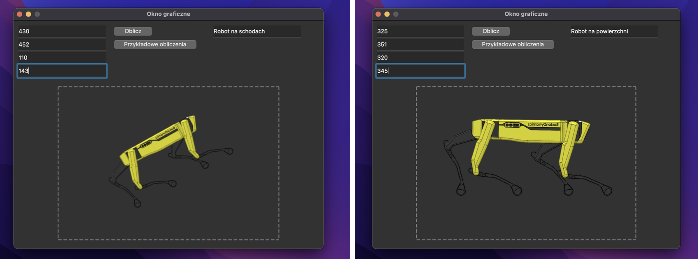
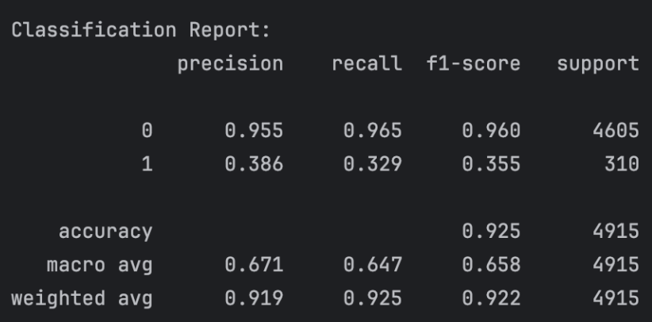

# 🤖 Detection of Spot Robot Position using Logistic Regression

This project focuses on predicting the **position of Boston Dynamics' Spot robot** using **logistic regression** and pressure sensor data.

---
## 📂 Project Structure
- [About](#about)
- [Technologies](#technologies)
- [Illustrations_and_example_of_work](#illustrations_and_example_of_work)
- [Conclusion](#conclusion)
- [License](#license)

---
## About
Machine learning, especially neural networks, is increasingly used beyond data science, particularly in automation and robotics. Boston Dynamics, known for robots like Spot the robot dog, builds highly accurate robots capable of navigating complex environments using sensors combined with machine learning models. The main goal of this project is to determine the robot’s position using sensor data — for example, to simply identify whether the robot is on a flat surface. This project is not intended as a complete solution (since sensors typically handle such tasks), but rather reflects the author’s personal interest in exploring machine learning possibilities.

---
## Technologies
Of course, this project could have been made much shorter using the `sky_learn` library, but that wouldn't be interesting. Instead, a full-fledged logistic regression model was written from scratch.  
Input data comes from foot pressure sensors. The logic is:
- If front-leg pressure > back-leg pressure, the robot is **going downstairs**.
- If back-leg pressure > front-leg pressure, the robot is **going upstairs**.
- If pressure is roughly equal across all legs, the robot is on **flat ground**.  

Only the following technologies were used:
- `numpy`
- `pandas`
- `PyQt`

---
## Illustrations_and_example_of_work
In the image below, you can see how the program works.  
After entering the foot pressure data, the image shows:

- **"Tilted robot"** — if the robot is on stairs (pressure difference between front and back legs).
- **"Straight robot"** — if the robot is on a flat surface (pressure is nearly equal on all legs).

- 

   
  <i>Figure: Accuracy and precision of model</i>

---
## Conclusion

This project demonstrates that a custom implementation of logistic regression can effectively classify the robot's position based solely on foot pressure data. Despite the possibility of using existing libraries like `sklearn`, building the model from scratch provided valuable insights into the inner workings of logistic regression.

The logic based on pressure difference between front and back legs allowed for determining whether the robot is going upstairs, downstairs, or moving on a flat surface. The model showed good accuracy, as demonstrated in the visualization above.

Possible future improvements include:
- Using more advanced machine learning algorithms (e.g., decision trees, neural networks).
- Collecting a larger dataset from real sensors.
- Implementing real-time detection and visualization in the GUI.
- Expanding the number of features (e.g., tilt angle, velocity).

The minimalist use of external libraries (`numpy`, `pandas`, and `PyQt`) shows that even with simple tools, effective machine learning applications can be built.

---
## License
MIT License

Copyright (c) 2025 Stanislav Kravtsiv

Permission is hereby granted, free of charge, to any person obtaining a copy
of this software and associated documentation files (the “Software”), to deal
in the Software without restriction, including without limitation the rights  
to use, copy, modify, merge, publish, distribute, sublicense, and/or sell  
copies of the Software, and to permit persons to whom the Software is  
furnished to do so, subject to the following conditions:

The above copyright notice and this permission notice shall be included in all  
copies or substantial portions of the Software.

THE SOFTWARE IS PROVIDED “AS IS”, WITHOUT WARRANTY OF ANY KIND, EXPRESS OR  
IMPLIED, INCLUDING BUT NOT LIMITED TO THE WARRANTIES OF MERCHANTABILITY,  
FITNESS FOR A PARTICULAR PURPOSE AND NONINFRINGEMENT. IN NO EVENT SHALL THE  
AUTHORS OR COPYRIGHT HOLDERS BE LIABLE FOR ANY CLAIM, DAMAGES OR OTHER  
LIABILITY, WHETHER IN AN ACTION OF CONTRACT, TORT OR OTHERWISE, ARISING FROM,  
OUT OF OR IN CONNECTION WITH THE SOFTWARE OR THE USE OR OTHER DEALINGS IN THE  
SOFTWARE.
